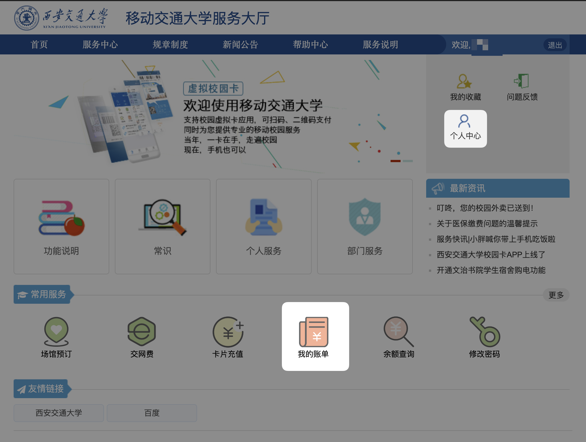
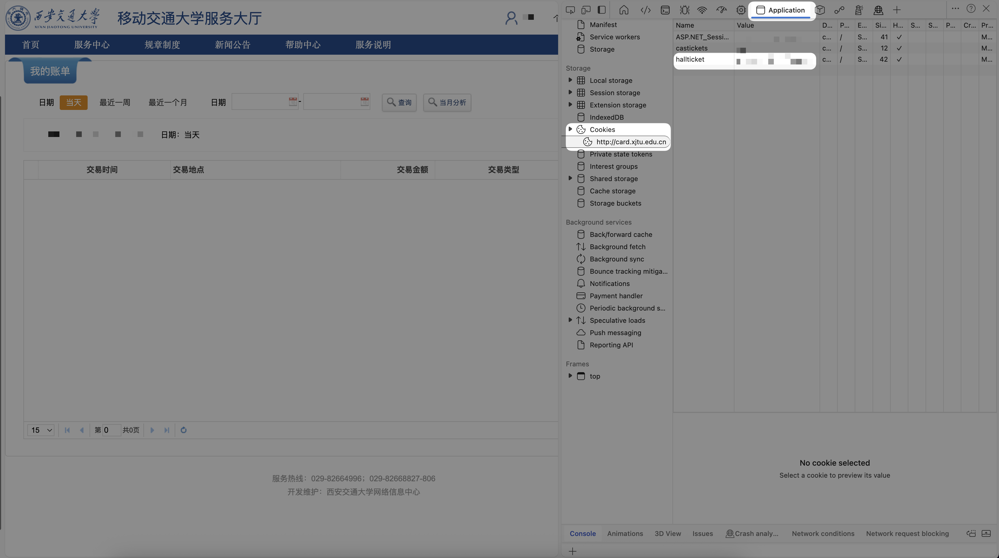

# XJTU MealFlow

[](https://github.com/yy4382/XJTU-MealFlow/actions/workflows/ci.yml) [](https://codecov.io/gh/yy4382/XJTU-MealFlow) [](https://github.com/XAMPPRocky/tokei)

你在西交吃了啥？

## 快速开始

### 获取 Account 和 Cookie

在[校园卡网站](http://card.xjtu.edu.cn)（在某些网络下只能使用 http 访问）获取account和hallticket。

登录网站后，主要使用**个人中心**和**我的账单**这两个功能来获取所需信息。



#### 获取 `account`
进入**个人中心**，点击右上角**账号管理**，即可找到**账号** (5-7 位的数字)。


#### 获取 `hallticket`
进入**我的账单**页面。打开浏览器的**开发者工具**（通常按 F12 或右键选择“检查”），切换到 Application 选项卡（可能在加号里，被折叠了），找到 Cookies，点击 `http://card.xjtu.edu.cn`，在右侧的列表中找到 `hallticket`，复制其中的内容。



### 运行

从 Release 下载对应系统的二进制文件，即可从终端运行。

```bash
# macOS, Linux
./xjtu-mealflow
```

```powershell
# Windows
.\xjtu-mealflow.exe
```

## License

Copyright (c) Chris Yang <yy4382@outlook.com>

This project is licensed under the MIT license ([LICENSE] or <http://opensource.org/licenses/MIT>)

[LICENSE]: ./LICENSE
